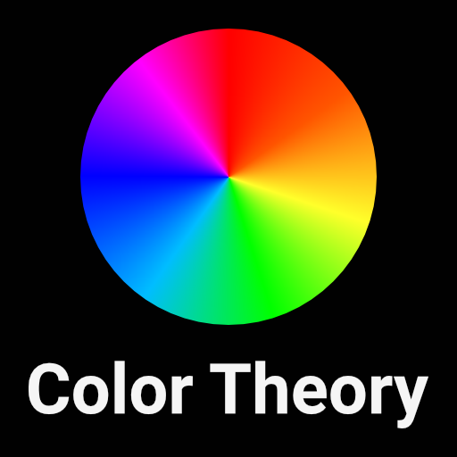

# Color Theory in Digital Design
## Painting Pixels with Purpose

In the vast canvas of digital design, color is a potent tool that transcends aesthetic appeal and delves into the realm of user experience and brand communication. Color theory, rooted in centuries of artistic and scientific exploration, finds a new avenue of expression within digital design. This article explores the nuances of color theory in digital design, illuminating how the right color choices can enhance user engagement, convey brand values, and create visually compelling digital experiences.

## The Color Wheel and Digital Design

#### Primary, Secondary, and Tertiary Colors:

The foundation of color theory is the color wheel, comprising primary (red, blue, yellow), secondary (green, orange, purple), and tertiary colors. Understanding these basic relationships helps designers craft color schemes that are harmonious and engaging.

#### Complementary and Analogous Colors:

Complementary colors are opposite each other on the color wheel, and when used together, create a vibrant look. Analogous colors, which are next to each other on the wheel, offer a more harmonious and nuanced appearance.

## RGB and HEX: The Digital Color Systems

#### RGB (Red, Green, Blue):

Digital devices display color using the RGB color model. Understanding the RGB color model is crucial for designers to ensure color accuracy across various devices.

#### HEX Code:

HEX codes are hexadecimal values used to specify colors in digital design. They provide a precise way to communicate and replicate colors in digital interfaces.

## Color Psychology in Digital Design

#### Emotional Resonance:

Colors evoke emotions and associations. For instance, red may evoke excitement or urgency, while blue often conveys trust and calmness. By understanding color psychology, designers can align color choices with brand messaging and desired user reactions.

#### Cultural Context:

The perception of color can vary significantly across different cultures. Being cognizant of cultural color connotations is vital, especially for global brands, to ensure the right message is conveyed.

## Accessibility and Color

#### Contrast and Legibility:

Ensuring high contrast between text and background colors is critical for readability. Tools like contrast checkers can assist designers in adhering to accessibility standards.

#### Colorblind Accessibility:

Designing with colorblind accessibility in mind is essential to create inclusive digital experiences. Utilizing patterns and textures alongside color can enhance usability for colorblind individuals.

## Color Consistency and Branding

#### Brand Color Guidelines:

Consistency in color usage across digital platforms reinforces brand identity. Establishing clear brand color guidelines helps maintain a cohesive brand image.

#### Color and Conversion Rates:

Strategic color usage can also impact conversion rates on websites and apps. For example, A/B testing different color schemes can provide insights into color preferences and user behaviors.

## Conclusion

Color theory is a fundamental aspect of digital design, intertwining with usability, branding, and user engagement. As designers paint the digital canvas, a profound understanding of color theory is instrumental in creating meaningful and visually captivating digital narratives. Through the lens of color theory, the digital world becomes a spectrum of opportunities, enabling designers to craft experiences that resonate with audiences and echo the brand's essence across the digital landscape.