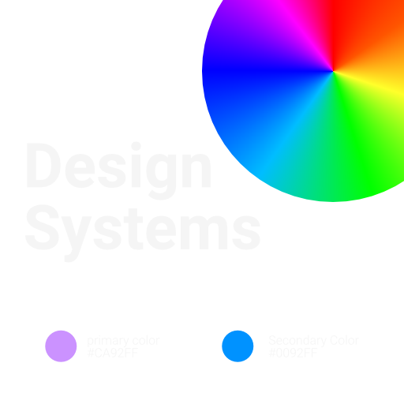

# Scaling Aesthetics: The Pervasive Reach of Design Systems Across Devices

Design systems stand as a pivotal axis in the modern digital ecosystem, orchestrating a harmonious user experience (UX) across a plethora of devices. As users seamlessly transition from web to mobile, tablet, and desktop interfaces, the essence of a brand and the ease of interaction should remain intact. This necessitates a robust design system capable of transcending device boundaries while maintaining a cohesive user interface (UI) and UX. This article explores how design systems bridge the device divide, ensuring consistency, scalability, and adaptability.

## A Unified Design Lexicon:

Design systems provide a unified design lexicon that forms the cornerstone of multi-device design. Through a well-defined set of components, patterns, and guidelines, they facilitate a common design language that ensures consistency across various device interfaces.

## Responsive Design:

- Fluid Grids: Employing fluid grids is fundamental for creating layouts that respond to different screen sizes and orientations, ensuring a seamless transition across devices.
- Flexible Images and Media: Design systems advocate for the use of flexible images and media that adapt to the constraints of different devices, maintaining visual coherence and engagement.
- Media Queries: Utilizing media queries allows for the application of different styles based on the characteristics of the device, ensuring an optimal user experience.

## Modular Components:

Design systems thrive on modularity, providing a repertoire of reusable components that can be assembled in various configurations to suit the needs of different devices.

## Adaptability and Context-Aware Design:

- Contextual Adaptation: Understanding the context in which different devices are used is crucial. Design systems provide guidelines for adapting UI elements to suit the ergonomic and situational context of each device.
- Device Features Utilization: Leveraging device-specific features and capabilities, such as touch gestures on mobile and tablets or hover states on desktop, enhances the user interaction and overall experience.

## Design Tokens:

Design tokens encapsulate design decisions, such as color, typography, and spacing, facilitating their application across different platforms and devices in a consistent and maintainable manner.

## Prototyping and Testing:

Design systems often come with tools for prototyping and testing designs across different devices, ensuring that the design solutions work harmoniously regardless of the device.

## Automation and Tooling:

The automation features inherent in design systems enable the generation of assets and code snippets tailored for different devices, streamlining the design-to-development workflow.

## Performance Optimization:

Design systems provide guidelines for optimizing performance, ensuring that designs are not only visually appealing but also efficient and responsive across all devices.

## Bridging the Device Divide:

As the lines between different devices continue to blur, the importance of a robust design system cannot be overstated. By facilitating a holistic design approach, design systems ensure that users enjoy a consistent and engaging experience, irrespective of the device they use. The future beckons a more integrated and intelligent design system capable of autonomously adapting to the ever-evolving device landscape, paving the way for a truly unified digital experience.