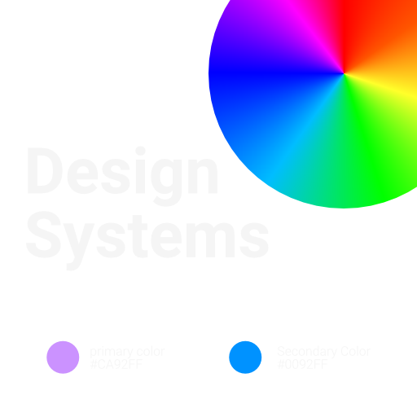

# Design Systems: Bridging the Gap Between Creativity and Consistency

In the realm of digital design, maintaining a harmonious balance between creativity and consistency is often seen as a lofty aspiration. This is where design systems come into play, acting as the bridge between these two seemingly opposing forces. Design systems are comprehensive frameworks that encompass a set of standardized design solutions, aiding teams in creating a more unified and user-centric digital experience.

## The Backbone of Digital Experiences

Design systems serve as the backbone of digital experiences. They offer a centralized hub of design standards, tools, and resources that ensure consistency across various platforms and products. The components of a design system often include a library of design elements, coding guidelines, and documentation, which streamline the design process and foster collaboration among teams.

## Components of Design Systems

- UI Components and Patterns: A design system houses a repository of reusable UI components and patterns. This not only accelerates the design process but also ensures a consistent user experience across all platforms.
- Design Tokens: These are the smallest units in a design system, representing design decisions such as colors, typography, and spacing, which can be reused across different parts of a system.
- Documentation: Effective documentation encapsulates the philosophy, principles, and guidelines of a design system. It serves as a roadmap, directing teams on how to utilize the system to its full potential.
- Tools: These include various software and plugins that support the design and development process, ensuring seamless collaboration and efficient workflow.
- Design Principles: Establishing a set of design principles is crucial for guiding decision-making and maintaining the integrity of the design system.

## The Evolution of Design Systems

Design systems are not a new concept, but their significance has grown exponentially with the advent of digital technology. They evolved from basic style guides and brand manuals to comprehensive systems that address complex design challenges in the digital realm. The rise of design systems can be attributed to the growing need for speed, efficiency, and scalability in design and development processes.

## Benefits of Implementing a Design System

- Consistency: By having a single source of truth, design systems mitigate inconsistencies and ensure a unified brand representation across all digital touchpoints.
- Efficiency: They streamline the design and development process by reducing redundancy, thus accelerating project timelines.
- Collaboration: Design systems foster a collaborative environment by providing a common language for both designers and developers.
- Scalability: They lay the foundation for scaling design solutions to a multitude of platforms and devices without compromising the user experience.

## The Road Ahead

The future of design systems seems promising as organizations continue to recognize their value. They are becoming more sophisticated and integrated, with a focus on automation, real-time collaboration, and data-driven design decisions. As the digital landscape continues to evolve, design systems will play a pivotal role in steering the direction of design practices, ensuring that creativity and consistency go hand in hand.