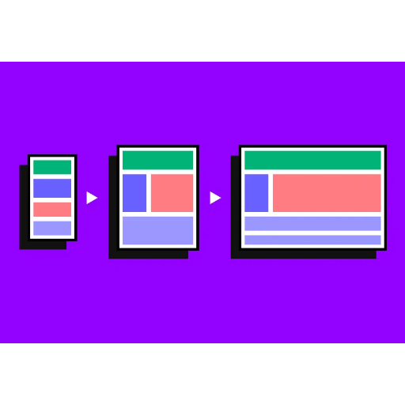

# Bridging Realities: The Art of Responsive Web Design

In a digital universe where users access web content through a myriad of devices, Responsive Web Design (RWD) emerges as the linchpin ensuring seamless interactions across all screen sizes. RWD is no longer a luxury; it’s a necessity, acting as a bridge between diverse device realities to deliver a cohesive user experience. This article elucidates the core principles of RWD and presents a case study showcasing its implementation in a real-world project.

## The Fabric of Responsive Design

Responsive Web Design is the art and science of designing web interfaces that provide an optimal viewing and interaction experience—easy reading and navigation with minimal resizing, panning, and scrolling—across a wide range of devices, from desktop monitors to mobile phones. The essence of RWD lies in its fluidity, the ability to adapt gracefully to the device it resides on.

## Core Principles of RWD

The magic of RWD is orchestrated through three fundamental principles:

- Fluid grids use relative units like percentages instead of absolute units like pixels for layout elements. This fluidity ensures the layout adapts to the screen size.

```css

    .container {
        width: 100%;
        max-width: 1200px;
        margin: auto;
    }


```

- Images are made flexible to ensure they stay within their containing element without breaking the layout.

```css

    img {
        max-width: 100%;
        height: auto;
    }


```

- Media queries allow CSS styling to be applied based on the device’s characteristics, such as its width, height, or orientation.

```css

    @media (max-width: 768px) {
        .sidebar {
            display: none;
        }
    }


```

## A RWD Case Study: Bridging User Experiences

In a recent project, I was tasked with revamping a client’s website to enhance its mobile user experience. The original site was a fixed-layout design, providing a subpar user experience on mobile devices.

The transformation began with the implementation of fluid grids, ensuring the layout was adaptable to various screen sizes. Flexible images were employed to preserve the aesthetic appeal without compromising the layout. Lastly, media queries were meticulously crafted to ensure a seamless transition of the user interface across different devices.

The result was a resounding success. The client reported a significant reduction in bounce rates, especially from mobile users, and an uptick in user engagement metrics.

## Your Bridge to Exceptional Web Experiences

Embarking on the responsive design journey is about embracing the fluid nature of the web. It’s about creating digital bridges that ensure users have a consistent and delightful experience, irrespective of the device they use.

If your website is yet to be responsive or if you're looking to create a new digital presence with RWD at its core, I am here to help. Let’s discuss your web design needs and craft digital experiences that resonate with your audience across all platforms.