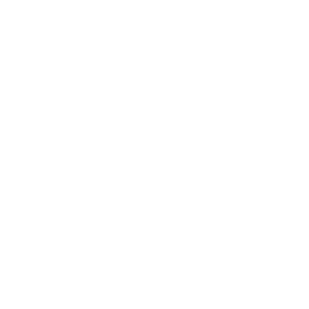

---

# User-Centric Design: Crafting Digital Experiences That Resonate

In the bustling digital marketplace, standing out is about creating experiences that echo with your users' needs and aspirations. The essence of User-Centric Design (UCD) dwells in its ability to craft digital landscapes that are tailored to the user, ensuring not just satisfaction, but delight. This approach not only elevates user experience but propels businesses towards success by cultivating loyal customers. In this narrative, we'll traverse through the methodologies and tools that form the bedrock of UCD, and share a real-world scenario where adopting a user-centric lens made a significant difference.

## Unveiling User-Centric Design (UCD)

User-Centric Design is an iterative design process in which designers focus on the users and their needs at each phase. It's about involving users through a blend of methods and tools to ensure the design serves their needs while providing a seamless interaction. The payoff is a product that resonates with your audience, leading to enhanced user satisfaction and business success.

## The Methodologies and Tools of UCD

UCD is not a one-off task but a continuous endeavor. Here are the key methodologies and tools employed in this journey:

- ##### User Research:
    The cornerstone of UCD is understanding your users. Tools like surveys, interviews, and persona creation help in gathering insights about user needs, behaviors, and pain points.

```
Persona Example:
Name: Emily, Age: 29, Occupation: Graphic Designer, Goals: Finding a platform for networking and showcasing her portfolio.
```

- ##### Wireframing:
Wireframing is about laying the skeletal structure of your interface, offering a visual guide that represents the page structure and navigation.

```
Wireframe Tool Example: Sketch, Adobe XD, Balsamiq
```

- ##### Usability Testing:
Usability Testing involves real users to evaluate the ease of use and identify any friction points that may impede the user experience.

```
Usability Testing Tool Example: Usertesting.com, Hotjar
```

## A Real-world Resonance: UCD in Action

In one of my freelance projects, I was approached by a client facing a high bounce rate on their e-commerce platform. The user journey was riddled with friction points, leading to cart abandonment.

Embarking on a UCD journey, I initiated user research to understand the pain points. Wireframes were then crafted to address these issues, followed by usability testing to validate the solutions. The redesigned user journey streamlined the checkout process and significantly reduced friction, leading to a substantial drop in cart abandonment and a notable increase in conversions. The client was elated with the transformation, and the users found the platform much more engaging and easy to navigate.

## Crafting Resonating Digital Experiences

User-Centric Design is not just a design approach; it's a commitment to creating digital experiences that echo with your users. If you are looking to forge digital solutions that resonate with your audience, I am here to assist. With a deep-rooted understanding of UCD and a plethora of successful projects, I am poised to help you craft digital landscapes that not only meet but exceed user expectations. Reach out, and let’s embark on a journey towards crafting user-centric digital experiences that propel your business towards success.

This article aims to unveil the importance of User-Centric Design and its impact on both user satisfaction and business growth. Through a blend of methodologies and a real-world case study, it underscores the power of a user-centric approach in solving real-world problems and enhancing user engagement. The call to action in the conclusion serves as an invitation for potential clients to explore your design services, positioning you as a seasoned designer ready to craft digital solutions that resonate with users.