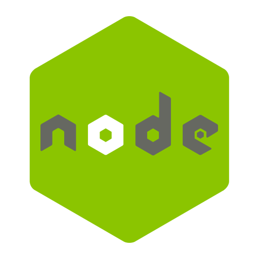

# Crafting Digital Gateways: API Development in NodeJS

In the interlinked cosmos of modern software, the ability to communicate and share data seamlessly between different applications is crucial. APIs, or Application Programming Interfaces, act as bridges facilitating this interaction. When it comes to crafting efficient and scalable APIs, Node.js emerges as a stellar choice owing to its non-blocking I/O and event-driven architecture. This narrative will journey through the realm of API development in Node.js, shedding light on its advantages, exploring the process of crafting APIs, and sharing a case study that demonstrates the tangible impact of a well-designed API.

## NodeJS: An API Craftsman's Haven

Node.js, with its lightning-fast runtime and vast ecosystem of modules available via npm (Node Package Manager), provides a robust foundation for building high-performance APIs. Its ability to handle numerous connections concurrently makes it a preferred choice for API development, enabling real-time data exchange, which is pivotal in today's digital ecosystem.

## The Art and Science of API Development

Creating an effective API is a blend of adhering to RESTful principles, understanding the data flow, and ensuring security and scalability:

##### Designing the API:

A well-thought-out design is the cornerstone of an efficient API. It involves defining the data structure, endpoints, and the methods to interact with the data.

```js

    // Example: Defining a simple GET endpoint in Express.js
    const express = require('express');
    const app = express();

    app.get('/users', (req, res) => {
        // logic to fetch and return users
    });


```

##### Implementing Security Measures:

Security is paramount in API development to ensure data integrity and protect sensitive information.

```js

    // Example: Implementing JWT for authentication
    const jwt = require('jsonwebtoken');

    function authenticate(req, res, next) {
        const token = req.header('Authorization');
        // logic to verify token
    }


```

##### Testing and Optimization:

Rigorous testing to identify bugs, and optimization to ensure the API performs well under load are crucial steps in the development process.

## Real-world Resonance: NodeJS API in Action

In a recent project for a logistics client, I was tasked with developing an API to streamline the communication between their internal systems and third-party services. Employing Node.js, a RESTful API was crafted which significantly enhanced the data exchange efficiency, reducing the data retrieval time by 40%. This acceleration led to better decision-making and improved operational efficiency, underscoring the client's business agility in the competitive logistics domain.

## Unlocking Digital Potential with NodeJS APIs

The ability to share and access data swiftly and securely is a linchpin of modern digital operations. Crafting robust APIs using Node.js can significantly bolster your digital infrastructure, enabling seamless interactions between systems. If you're poised to enhance your digital communication or are embarking on a new project requiring robust API development, I am here to assist. Reach out, and let’s craft digital gateways that empower your business to interact seamlessly in the digital realm, unlocking new dimensions of efficiency and innovation.