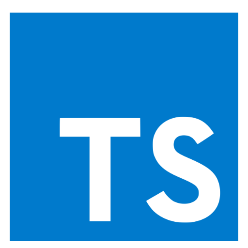

# Embracing TypeScript: A Journey from JavaScript

In the vibrant realm of web development, choosing the right programming language is akin to choosing the right brush for a painting. It's about finding that perfect tool that not only gets the job done but does so with flair and efficiency. My journey from JavaScript to TypeScript has been an enlightening voyage into a type-safe harbor amidst the dynamic waves of web development. Through this article, I intend to share my insights on transitioning from JavaScript to TypeScript and the bevy of benefits it brings along.

## The Genesis: JavaScript

JavaScript has long been the quintessential tool for breathing life into static web pages, turning them into interactive digital canvases. Its dynamic nature and ease of use have made it a favorite among developers. However, as projects scaled, I started to feel the pinch of JavaScript's dynamic typing, especially when working in large teams with complex codebases.

### The Transition: Entering TypeScript Waters

- The learning curve: Transitioning to TypeScript came with a learning curve, especially around understanding static typing and setting up a TypeScript project. However, the robust documentation and vibrant community smoothed out the learning journey.

- Refactoring: TypeScript's static type checking was a blessing during code refactoring. It drastically reduced the time spent hunting down elusive bugs that would otherwise creep in during the refactoring process.

### The Boons of TypeScript

- One of the hallmark benefits of TypeScript is its static type system. It catches type-related errors at compile-time, which translates to fewer bugs, better maintainability, and a smoother developer experience.

- TypeScript’s ability to provide better autocompletion, navigation, and refactoring services is a game-changer. It makes the development environment more intelligent and developer-friendly.

- TypeScript’s module system, coupled with its support for modern JavaScript features, makes it an excellent choice for building large-scale applications.

- Working in a team became more streamlined with TypeScript. The type annotations serve as excellent documentation, making it easier for teammates to understand the code and collaborate effectively.

- The growing community and the wealth of libraries with TypeScript definitions is a significant advantage, making it easier to find solutions to problems and leverage existing solutions.

## The Horizon: TypeScript’s Future

With the continuous evolution of TypeScript and its growing adoption in the developer community, it's clear that TypeScript has a bright future ahead. The robustness and efficiency it brings to the table make it a compelling choice for modern web development projects.

## Conclusion

Transitioning from JavaScript to TypeScript has been a rewarding adventure, propelling my projects to a realm of enhanced robustness, readability, and maintainability. As a freelance developer, my quest for delivering top-notch, bug-free, and scalable applications to my clients has found a reliable companion in TypeScript. If you’re embarking on a new project or considering switching to a type-safe environment, I’m here to guide and collaborate on your TypeScript journey, ensuring a smooth sail towards your development goals. Together, let’s harness the power of TypeScript to build applications that stand the test of time.